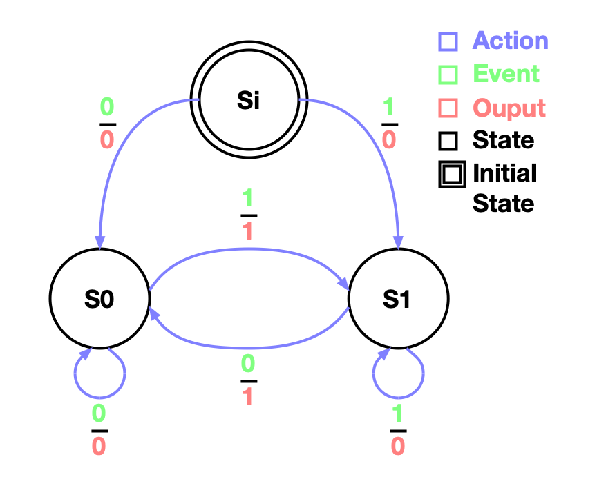
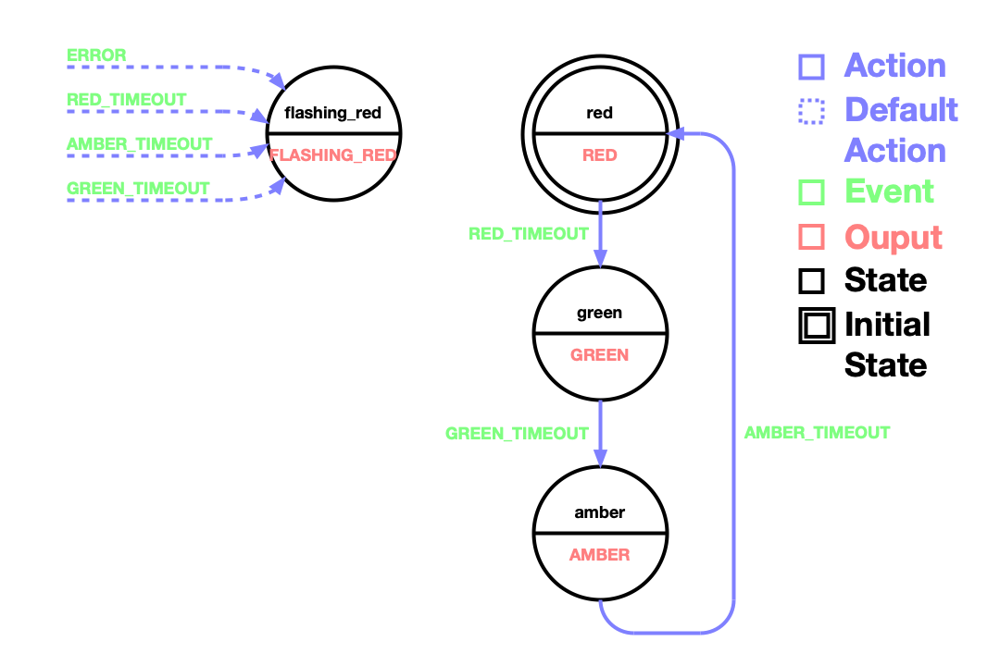

# statmach

## Pythonic Finite State Machine

State machines represent different states, and the transition between states 
that have a repetitive sequence that is pre-determined.
Examples are many appliances (kettle, toaster, etc.),
machines in general (traffic lights, factory automation, etc.), and
stateful software (UI screens, wizards, etc.).
These are very broad categories of uses and therefore state machines are common.

A frequent characteristic of a state machine is that the input events 
arrive asynchronously and therefore adding
a formal structure is useful otherwise the code becomes difficult to understand, 
debug, and maintain.
You can 'roll-your-own' state machine; but using a pre-tested module, 
like this one,
is both easier and more reliable.
In particular, error handling is very tricky to get right.

At a top (most abstract) level state machines are easy to code, just:

  1. List the inputs (events).
     Actually a set of events because you can't have repeats.
     Also, the set is finite, i.e. can't have an infinite number of inputs.
     In practice state machines are only practical if the number of events 
     is less than about 100.
  2. List the states.
     Again actually a set, no repeats.
     Again only practical up to a few 100.
  3. List the transitions from one state to the next in response to an event 
     and at the same time give the new output.
  
The above requirements are often represented as a state diagram, 
which helpful to document code (see example diagrams below).

### Installation

The code is written in Python 3.5 and is designed run on 
[MicroPython](https://micropython.org) 
(making it suitable for real hardware) as well as desktop (normal) Python.
All the code is in one small file (``statmach.py``).

  1. pip install --upgrade statmach
  2. Copy ``statmach.py`` into your project
     (probably needed for a Micropython project - IDE dependent).

### Terminology Used in this Module

  1. The overall state machine is a ``Machine``.
  2. The state machine has ``States``.
  3. Inputs to the machine are events, which are typically enum members.
  4. The response of a ``State`` to an event is an action, 
     which is a tuple of: new-state and new-output.
  5. Events are ``fired`` into the ``Machine`` and 
     the actions give the new states and new outputs.

### Making a State Machine

The steps to make a state machine are:

  1. Define input events, typically using an enum or class 
     with just class attributes.
  2. Define outputs,
     which is often an enum but could be as complicated as a function 
     to execute to obtain a derived value.
  3. Define states (class ``State``).
  4. Define actions (tuples of new state and new value)
     to take when events fire (add actions to the states and the machine).
  5. Define a ``Machine`` using a ``with`` statement.
  6. Fire events into the machine and obtain outputs.
  
E.g. an edge detector
(it detects when its input changes from 0 to 1 or vice versa 
and outputs a 1 if it does, otherwise a 0):



States are traditionally drawn as circles; 
and the initial state is marked with a double circle (shown in black).
States traditionally have an identifier, 
because it is easier to follow what is happening if a state is uniquely identified.
The identifiers are inside the circles that representing the states.
Actions are the arrows from one state to the next (shown in blue).
Inputs that cause the action to be taken are above the line on the 
action annotation (shown in green).
Outputs that result when the action is taken are below the line on the 
action annotation (shown in red).
    
```python
from enum import Enum
from statmach import  State, Machine

Bit = Enum('Bit', 'ZERO ONE')  # 1. & 2. Define the inputs (in this case also the outputs).

s_i = State(ident='i')  # 3. Define the states.
s_0 = State(ident=0)
s_1 = State(ident=1)

s_i.actions = {Bit.ZERO: (s_0, Bit.ZERO), Bit.ONE: (s_1, Bit.ZERO)}  # 4. Define the actions.
s_0.actions = {Bit.ZERO: (s_0, Bit.ZERO), Bit.ONE: (s_1, Bit.ONE)}
s_1.actions = {Bit.ZERO: (s_0, Bit.ONE), Bit.ONE: (s_1, Bit.ZERO)}

with Machine(initial_state=s_i) as machine:  # 5. Define the machine.
    assert machine.state is s_i
    assert machine.fire(event=Bit.ZERO) is Bit.ZERO  # 6. Fire events and obtain outputs.
    assert machine.state is s_0
    assert machine.fire(event=Bit.ZERO) is Bit.ZERO
    assert machine.state is s_0
    assert machine.fire(event=Bit.ONE) is Bit.ONE
    assert machine.state is s_1
    assert machine.fire(event=Bit.ONE) is Bit.ZERO
    assert machine.state is s_1
    assert machine.fire(event=Bit.ZERO) is Bit.ONE
    assert machine.state is s_0
```

Note how the startup is dealt with, initially outputting a 0 for either input.
This special start up condition is achieved using a
start up state that is not used again after the first event is fired.
This unique startup state is a common feature of state space machines.

The edge detector is an example of a state machine that has an 
output associated with each action;
these are called Mealy Machine (see below),
and they use the class ``State`` to define their states.

A more complicated example is a traffic light machine:


    
This state diagram has three features that are different 
from the edge detector diagram above:

  1. The output is associated with the state not the action, 
     i.e. all transition to a given state result in the same output.
     This is denoted in the diagram by the below the line output shown 
     on the state (in red) and not on the action annotation.
  2. The machine has actions that are the default for all states, 
     shown as a dotted line that does not originate from a state (shown in blue).
     These machine actions are 'overridden' by state actions, 
     hence their dotted nomenclature to indicate lesser.
  3. There is no way out of state 'flashing_red' (it is a terminal failure); 
     other than restarting the machine so that it goes back to 'red'.

The traffic light example has two common requirements: the events arrive 
asynchronously, and it is important (because it is safety critical)
that all events are dealt with even if they arrive unexpectedly.
For example if the traffic light is red when the amber timeout occurs, 
this is an error because the machine is waiting
for the red timeout not the amber.

Note in the diagram, upper left, how the unexpected events and the 
error event are dealt with for the whole machine,
rather than coding this requirement on all states individually.
These machine actions can be 'overridden' by a state; 
so for example when in the red state and
the red timer finished the next state is green, as expected (not an error).

The advantage of the machine dealing with common actions is that the actions 
of the state machine are much
easier to follow.

```python
from enum import Enum, auto
from statmach import  StateWithValue, Machine

class Inputs(Enum):  # 1. The inputs.
    RED_TIMEOUT = auto()
    AMBER_TIMEOUT = auto()
    GREEN_TIMEOUT = auto()
    ERROR = auto()

class Outputs(Enum):  # 2. The outputs.
    RED = auto()
    AMBER = auto()
    GREEN = auto()
    FLASHING_RED = auto()

flashing_red = StateWithValue(ident='flashing_red', value=Outputs.FLASHING_RED)  # 3. The states.
red = StateWithValue(ident='red', value=Outputs.RED)
amber = StateWithValue(ident='amber', value=Outputs.AMBER)
green = StateWithValue(ident='green', value=Outputs.GREEN)

red.actions[Inputs.RED_TIMEOUT] = green.action  # 4a. The *state* actions.
green.actions[Inputs.GREEN_TIMEOUT] = amber.action
amber.actions[Inputs.AMBER_TIMEOUT] = red.action

with Machine(initial_state=red) as machine:  # 5. The machine.
    machine.actions[Inputs.RED_TIMEOUT] = flashing_red.action  # 4b. The *machine* actions.
    machine.actions[Inputs.AMBER_TIMEOUT] = flashing_red.action
    machine.actions[Inputs.GREEN_TIMEOUT] = flashing_red.action
    machine.actions[Inputs.ERROR] = flashing_red.action

    assert machine.state is red
    assert machine.fire(event=Inputs.RED_TIMEOUT) is Outputs.GREEN  # 6. Fire events and obtain outputs.
    assert machine.state is green
    assert machine.fire(event=Inputs.GREEN_TIMEOUT) is Outputs.AMBER
    assert machine.state is amber
    assert machine.fire(event=Inputs.AMBER_TIMEOUT) is Outputs.RED
    assert machine.state is red
    assert machine.fire(event=Inputs.AMBER_TIMEOUT) is Outputs.FLASHING_RED
    assert machine.state is flashing_red
    assert machine.fire(event=Inputs.ERROR) is Outputs.FLASHING_RED
    assert machine.state is flashing_red
```

Note how the defining actions in this case are split between state actions, 
4a, and machine actions, 4b,
which makes the code shorter, easier to maintain, and easier to debug.

The traffic light machine is an example of a state machine that has an output 
associated with each state,
these are called Moore Machines (see below), and they use the class 
``StateWithValue`` to define their states.

The traffic light example can be run on real hardware, 
for example a [PyBoard](https://store.micropython.org/product/PYBv1.1H).
The complete project is on 
[Github](https://github.com/hlovatt/upythonstatmachex/tree/master).
The code is below and is an example of a third type of state machine, 
one were the output is a side effect of enetering and leaving the states
(it is therefore a variation on a Moore Machine).
In particular the ``__entry__`` and ``__exit__`` methods affect control the outputs:

```python
from statmach import State, Machine
from pyb import LED, Timer, wfi, Switch
from micropython import alloc_emergency_exception_buf, schedule

alloc_emergency_exception_buf(200)


def main():
    print('Traffic lights running ...')

    class Events:
        RED_TIMEOUT = 1
        AMBER_TIMEOUT = 2
        GREEN_TIMEOUT = 3
        ERROR = 4
        START = 5

    start = State(ident='start')  # Special start state to allow for initialization before operation.

    timer0 = 10

    class FlashingRed(State):  # Special fault state that should never exit.
        def __init__(self):
            super().__init__(ident='error')
            self.timer = Timer(timer0 + 4)
            self.led = LED(1)

            # noinspection PyUnusedLocal
            def toggle_with_arg(not_used):  # Toggle func that accepts an arg, because ``schedule`` *needs* an arg.
                self.led.toggle()

            self.led_tog_ref = toggle_with_arg  # Store the function reference locally to avoid allocation in interrupt.

        def __enter__(self):
            self.timer.init(freq=2, callback=lambda _: schedule(self.led_tog_ref, None))
            return self

        def __exit__(self, exc_type, exc_val, exc_tb):
            self.led.off()
            self.timer.deinit()

    flashing_red = FlashingRed()

    traffic_lights = Machine(initial_state=start)  # The traffic light machine.
    traffic_lights.actions[Events.RED_TIMEOUT] = (flashing_red, None)  # Catch anything unexpected.
    traffic_lights.actions[Events.AMBER_TIMEOUT] = (flashing_red, None)
    traffic_lights.actions[Events.GREEN_TIMEOUT] = (flashing_red, None)
    traffic_lights.actions[Events.ERROR] = (flashing_red, None)
    traffic_lights.actions[Events.START] = (flashing_red, None)

    tl_fire_ref = traffic_lights.fire  # Store the function reference locally to avoid allocation in interrupt.
    error = Switch()
    error.callback(lambda: schedule(tl_fire_ref, Events.ERROR))

    class LEDState(State):  # Output is determined by ``__enter__`` and ``__exit__`` (common in embedded machines).
        def __init__(self, led_num, time_on, event):
            super().__init__(ident=led_num)  # Use the LED num as the ident.
            self.led = LED(self.ident)  # The LED to use.
            self.timer = Timer(timer0 + self.ident)  # The timer to use.
            self.timeout = time_on  # Time to wait before firing event.
            self.event = event  # Event to fire at end of time_on.

        def __enter__(self):
            self.led.on()
            self.timer.init(freq=1 / self.timeout, callback=lambda _: schedule(tl_fire_ref, self.event))
            return self

        def __exit__(self, exc_type, exc_value, traceback):
            self.led.off()
            self.timer.deinit()
            return False

    red = LEDState(led_num=1, time_on=3, event=Events.RED_TIMEOUT)
    green = LEDState(led_num=2, time_on=3, event=Events.GREEN_TIMEOUT)
    amber = LEDState(led_num=3, time_on=0.5, event=Events.AMBER_TIMEOUT)

    red.actions[Events.RED_TIMEOUT] = (green, None)
    green.actions[Events.GREEN_TIMEOUT] = (amber, None)
    amber.actions[Events.AMBER_TIMEOUT] = (red, None)
    start.actions[Events.START] = (red, None)

    with traffic_lights:
        _ = traffic_lights.fire(event=Events.START)  # Start the machine once all the setup is complete.
        while True:  # Keep running timers (and other peripherals), but otherwise do nothing.
            wfi()
```

The Micropython code is as for the desktop Python code above for,
except that the output occurs in the ``__entry__`` and ``__exit__`` methods.
In particular these methods start and stop timers and turn LEDs on and off.
The timers in turn schedule events to fire when they timeout.
A further difference between the Micropython and desktop code
is that the Micropython code has a start state, this state is to allow the
state machine to be initialized before it is started 
(which is common for state machines)

For more state machine examples see ``test_statmach.py``.

### Pythonic Aspects of this Module

  1. ``Machine`` is a ``State`` (inheritance), so that machines can be nested.
  2. Both ``State`` and ``Machine`` are context managers,
     which allows for enter and exit code and error handling.
  3. Use Python ``with`` for executing a ``Machine``.
  4. Warnings (python ``warnings`` module) can optionally be issued if 
     input events handled changes during execution.

### Formal Definition

The state machine implemented is a Mealy machine, 
see https://en.wikipedia.org/wiki/Mealy_machine,
but a Moore Machine, the other common type of state machine, 
can also be easily represented see ``StateWithValue``.
The formal definition of a Mealy machine is a 5-tuple (S, S0, Σ, Λ, T) 
that consisting of the following:

  * A finite set of states S.
    Class ``State`` represents a state.
  * A start state (also called initial state) S0 which is an element of S.
    When a ``Machine`` is created it must be given an initial state.
  * A finite set called the input alphabet Σ.
    Inputs are unique objects, typically members of an enum.
  * A finite set called the output alphabet Λ.
    The output is any type.
  * A combined transition and output function T : S × Σ → S × Λ.
    The transitions are actions on each state that are called 
    when the corresponding event fires,
    the actions give the new state and new output.

In the strictest sense the state machine implemented by this module is 
superset of a Mealy Machine because:

  1. The code does not enforce that there are a fixed set of: states (S), 
     events (Σ), etc. and these sets can be
     added to or removed from whilst executing the machine.
  2. Both the machine and the state classes can be extended to add extra 
     fields to them
     (thus giving extra state that is not part of the state machine 'per se').
  3. Has extensive error control via Python exceptions and handling in 
     ``__exit__``.
  4. Has machine actions that can be 'overridden' by state actions.
  5. The machine is also a state and therefore machines can be nested.

